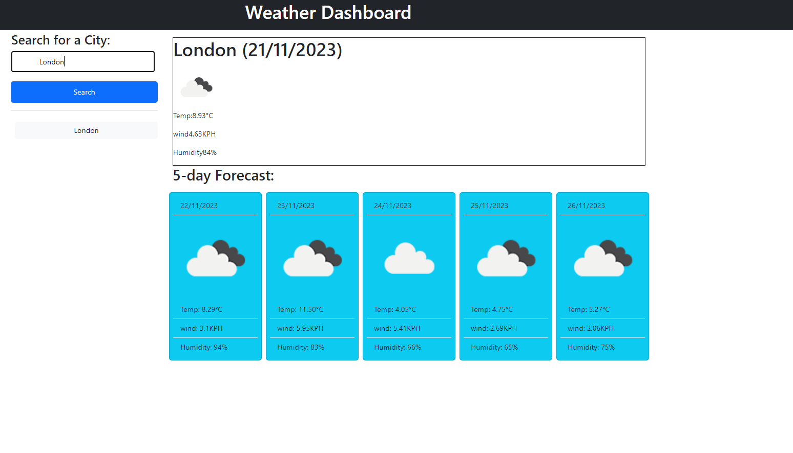

# Weather Dashboard

## Description 

A weather dashboard that grab live data using openweather api to check current and 5 day forecast for the city of your choice.

## Table of Contents (Optional)

* [Installation](#installation)
* [Usage](#usage)
* [Credits](#credits)
* [License](#license)

## Installation

Type the city in input and press the search button to find the weather for the next 5 days.

## Usage 

The weather forecast for the next 5 days will be shown under the webpage.

Link to application: https://ccc7321.github.io/weather-dashboard/

## Credits

Thanks Omar for the lessons and openweatherapi.

## License

Please refer to licence in the repo.

---

